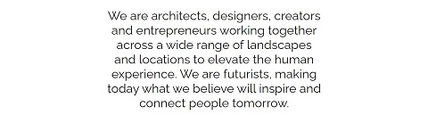
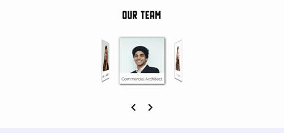

# Company Home Page with Flexbox

Company Home Page with Flexbox is one of Codecademy's open-ended projects, in which it is encouraged to problem solve and utilize other resources, instead of being provided with step-by-step guidance. The requirements were to utilize flexbox to design and build the layout for a company’s homepage. We could choose to redesign a homepage for an existing company or create our own imagined company. We were instructed to decide exactly what content to create for this company, including a title or logo and splash image, a mission statement or brief description of the company, a set of images representing the products or services of the company, and a section describing some of the company's employees or teammates. We also needed to utilize flexbox styling for layout and create custom styled properties with colors, fonts and our own selected images.

## Table of Contents

- [Technologies](#technologies)
- [Screenshots](#screenshots)
- [Status](#status)

## Technologies

This project was created with:

- JavaScript ES6
- HTML5
- CSS3 (SCSS)

## Screenshots

## Status

This project has been completed.